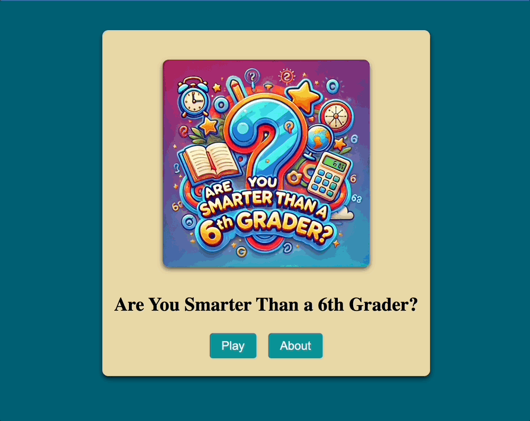

# AreYouSmarter

This project was generated using [Angular CLI](https://github.com/angular/angular-cli) version 19.1.0.

## About the Project

Are You Smarter Than a 6th Grader is an interactive quiz application inspired by the popular game show. Players are challenged with progressively difficult questions from 1st to 6th grade, with the final question sourced dynamically via an API call to the [Open Trivia Database](https://opentdb.com/).

This application was built using Angular, TypeScript, and Jest, with the primary goal of enhancing skills in these technologies while creating an engaging and educational game.



## Features

### Dynamic Question Progression

- Players move from 1st to 6th-grade questions, with dynamic headers like “Are you smarter than a 3rd grader?”.
- The final question is fetched from an external API for added variety.

### Data Binding

- Real-time updates between the application state and the user interface using Angular’s powerful data-binding mechanisms.

### Component-Based Architecture

- A modular design with components like QuestionComponent, AboutComponent, HomeComponent, and ResponseModalComponent ensures scalability and maintainability.

### Router Integration

- Seamless navigation between “Home,” “About,” and “Game” views using Angular Router.

### API Integration

- The application integrates with the Open Trivia Database API to fetch 6th-grade questions dynamically.

### Unit Testing

- Jest is used for robust unit testing, ensuring code reliability and minimizing bugs

### CSS Styling

- Custom styles, responsive design, and interactive modals enhance the user experience.

## Technologies Learned

This was my first time building an application with Angular, and it was exciting to explore how it compares to React and Vue, two frameworks I’ve used in the past. Here’s what I noticed:

Similarities Between React, Vue, and Angular

1. Components: All three frameworks are built around components, making it easy to break the UI into reusable pieces.
2. Data Binding: They all allow you to bind data to the user interface, though Angular and Vue make it easier with two-way data binding compared to React’s one-way approach.
3. Routing: Navigating between pages is simple with built-in or add-on routers in each framework.
4. State Management: While each has its own way to manage data, Angular uses services and RxJS for this purpose.

What Makes Angular Special

1. All-in-One Framework: Angular comes with many features built-in, like routing, HTTP handling, and form management. In React and Vue, you often need to add extra libraries for these.
2. Two-Way Data Binding: Angular makes it simple to keep the data in your forms and UI synchronized with the underlying model.
3. TypeScript: Angular is built on TypeScript, which adds strong typing and helps catch errors while coding.
4. Directives: Angular uses special syntax like *ngIf and *ngFor to make dynamic HTML easier to write.
5. Reactive Programming: Angular uses RxJS, a tool for handling asynchronous tasks like fetching data, which can make your code cleaner and more powerful.

## Technologies Used

[![Angular][Angular]][Angular-url]

[![TypeScript][TypeScript]][TypeScript-url]

[![CSS][CSS]][CSS-url]

[![Cypress][Cypress]][Cypress-url]

[![Jest][Jest]][Jest-url]

## Development server

To start a local development server, run:

```bash
ng serve
```

Once the server is running, open your browser and navigate to `http://localhost:4200/`. The application will automatically reload whenever you modify any of the source files.

## Running unit tests

To execute unit tests with the [Karma](https://karma-runner.github.io) test runner, use the following command:

```bash
ng test
```

## Running end-to-end tests

For end-to-end (e2e) testing, run:

```bash
ng e2e
```

Angular CLI does not come with an end-to-end testing framework by default. You can choose one that suits your needs.

[Angular]: https://img.shields.io/badge/Angular-DD0031?style=for-the-badge&logo=angular&logoColor=white
[Angular-url]: https://angular.io/

[TypeScript]: https://img.shields.io/badge/TypeScript-3178C6?style=for-the-badge&logo=typescript&logoColor=white
[TypeScript-url]: https://www.typescriptlang.org/

[CSS]: https://img.shields.io/badge/CSS3-1572B6?style=for-the-badge&logo=css3&logoColor=white
[CSS-url]: https://developer.mozilla.org/en-US/docs/Web/CSS

[Cypress]: https://img.shields.io/badge/Cypress-17202C?style=for-the-badge&logo=cypress&logoColor=white
[Cypress-url]: https://www.cypress.io/

[Jest]: https://img.shields.io/badge/Jest-C21325?style=for-the-badge&logo=jest&logoColor=white
[Jest-url]: https://jestjs.io/
